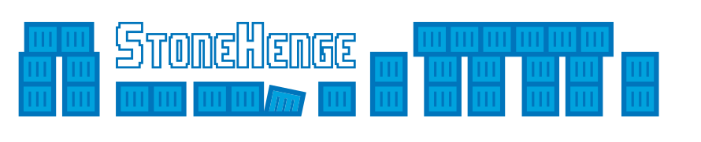

# Stonehenge



Local development environment toolset on Docker supporting multiple projects.


## What does it do?

Stonehenge aims to solve the basic problem for web developers: How to do development on local environment as easily as
possible.

Stonehenge provides you a shared development environment for multiple projects. It will handle the routing and local
domains for your projects as well as SSL certificates for those domains out of the box.

## Requirements for Stonehenge

- Latest macOS, Ubuntu LTS or Windows 10/11 with WSL2 - [Read more](#supported-operating-systems)
- Make
- Docker 20+
- Docker Compose
- No other services listening port 80 or 443

## Requirements for a project

- `docker-compose.yml` file(s) - see [examples](#examples) how to use Stonehenge

## Stonehenge building blocks

- [Traefik](https://traefik.io/traefik/) in [traefik.docker.so](https://traefik.docker.so) to handle all traffic to containers
- [mkcert](https://github.com/FiloSottile/mkcert) generated wildcard SSL certificate
- [MailHog](https://github.com/mailhog/MailHog) in [mailhog.docker.so](https://mailhog.docker.so) to catch emails

## Setup

Note: in some systems setup will prompt once for your password as it will setup DNS.

If on Windows, check these [general install instructions](WSL2.md) if you don't have WSL2 yet.

### Oneliner

```
sh -c "$(curl -fsSL https://raw.githubusercontent.com/druidfi/stonehenge/4.x/install.sh)"
```

### Or manually with Git

```
git clone -b 4.x https://github.com/druidfi/stonehenge.git ~/stonehenge
cd ~/stonehenge
make up
```

### Using custom domain

You can also use custom domain instead of `docker.so`:

```
make up DOCKER_DOMAIN=docker.druid.fi
```

Or alternatively change DOCKER_DOMAIN value in `.env` file.

## Stop or shutdown Stonehenge

Note: Stonehenge will be started on boot by default if not stopped before.

To stop Stonehenge:

```
make stop
```

Or totally to stop and remove Stonehenge:

```
make down
```

## Add alias

Add this line to your shell (bash, zsh, fish):

```
alias stonehenge='make -C ~/stonehenge'
```

Now you can run make targets from anywhere with the alias:

```
stonehenge up
```

## SSH keys

By default Stonehenge tries to add key from `~/.ssh/id_ed25519` and `~/.ssh/id_rsa`.

You can add additional SSH keys with:

```
make addkey KEY=/path/to/mykey
```

## Examples

- [Drupal 9](examples/drupal)
- [Ghost 4](examples/ghost)
- [Hugo](examples/hugo)
- [Laravel 9](examples/laravel)
- [Symfony 6](examples/symfony)
- [Wordpress](examples/wordpress)

## Supported operating systems

- macOS Monterey 12 (Intel and M1)
- macOS Big Sur 11 (Intel and M1)
- Ubuntu 20.04 LTS
- [Windows 10/11 + WSL2](WSL2.md) (Debian or Ubuntu LTS)

Also tested with at some point:

- Arch Linux

## Fork and modify

To brand the toolset for your organization:

- Fork this repository
- Modify `.env` file e.g. like follows:
  - `COMPOSE_PROJECT_NAME=company`
  - `DOCKER_DOMAIN=docker.company.com`
  - `PREFIX=company`
- Point your `docker.company.com` and `*.docker.company.com` to `127.0.0.1`
- IMPORTANT! Let us know! <3

## Debug

Use following command to see what data is detected:

```
make debug
```

## TODO

- Support for Debian and RHEL
- More examples
- Shell detection and autocreate the alias

## References

- [https://github.com/mailhog/MailHog](https://github.com/mailhog/MailHog)
- [https://github.com/FiloSottile/mkcert](https://github.com/FiloSottile/mkcert)
- [https://traefik.io/](https://traefik.io/)

## License

The files in this archive are released under the MIT license. You can find a copy of this license in [LICENSE](LICENSE).
