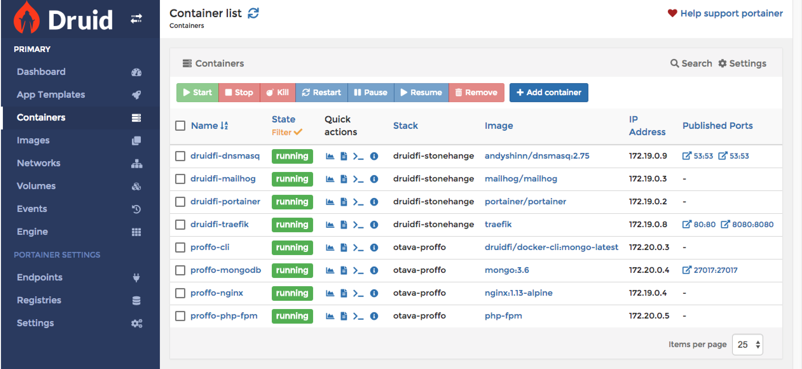
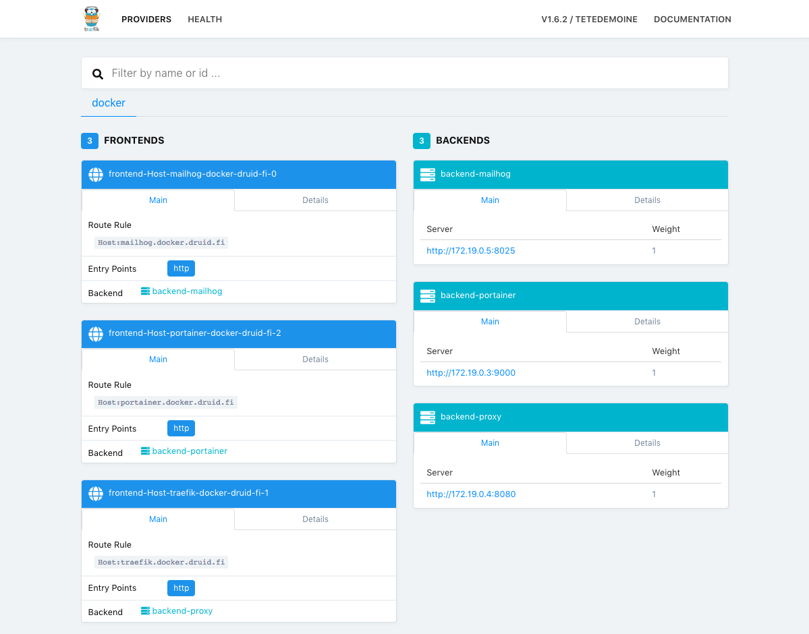

# druidfi/stonehenge

Local development environment toolset on Docker supporting multiple projects.

## Requirements

- Docker for Mac 18.03+
- No other services listening port 80 (e.g. Pygmy or nginx-proxy)

## Included containers

- `andyshinn/dnsmasq` to route `*.docker.druid.fi` to `127.0.0.1`
- `mailhog/mailhog` in [mailhog.docker.druid.fi](http://mailhog.docker.druid.fi) to catch emails
- `portainer/portainer` in [portainer.docker.druid.fi](http://portainer.docker.druid.fi) to manage your Docker
- `traefik` in [traefik.docker.druid.fi](http://traefik.docker.druid.fi) to handle all our reverse proxy needs

## Setup

Note: setup will prompt once for your password as it creates resolver file in `/etc/resolver` folder.

### Oneliner

```
$ sh -c "$(curl -fsSL https://raw.githubusercontent.com/druidfi/stonehenge/master/install.sh)"
```

### Or manually with Git

```
$ git clone git@github.com:druidfi/stonehenge.git ~/druidfi-stonehenge
$ cd ~/druidfi-stonehenge
$ make up
```

## Project implementation

- See https://github.com/druidfi/otava-amisreformi/tree/PROF-X-traefik

## TODO

- Project implementation
- Linux support

## Screenshots

Portainer



Traefik



## References

- [https://github.com/andyshinn/docker-dnsmasq](https://github.com/andyshinn/docker-dnsmasq)
- [https://github.com/mailhog/MailHog](https://github.com/mailhog/MailHog)
- [https://portainer.io/](https://portainer.io/)
- [https://traefik.io/](https://traefik.io/)
